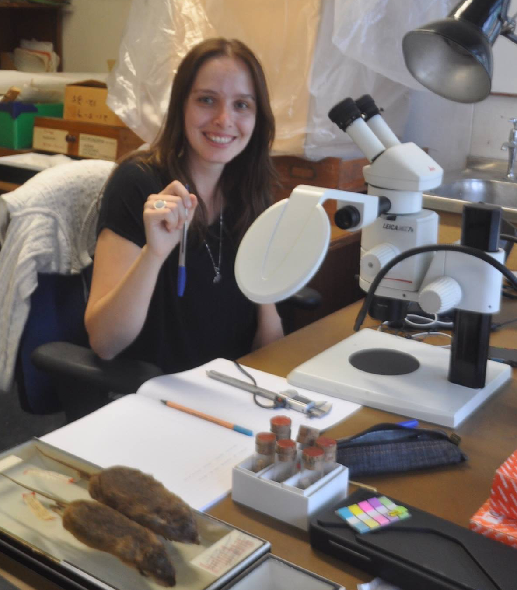

---
 

 I'm amazed with processes that generate diversity and speciation. 
My research line is focused on integrating ecological, morphological and genetic data to study the evolutionary history of Neotropical mammals.
I am current studying how the ecological restrictions imposed by different environments in South America structure the genetic variation and demographic 
history in taxa with shared life history traits.

I'm a postdoctoral fellow at Universidade de São Paulo (USP), where I also did my PhD (2017) and my Msc (2012), advised by Alexandre Percequillo.
During my PhD I was a visitor researcher at University of Michigan (UMICH), spending sometime in [Lacey Knowles' lab](https://sites.lsa.umich.edu/knowles-lab/).
Right after my PhD I was a postdoctoral fellow at Universidade Federal do Espírito Santo (UFES) supervised by Leonora P. Costa.

  

####You can find my updated CV [here](files/CV_JRP.pdf).

  

  
   
  

