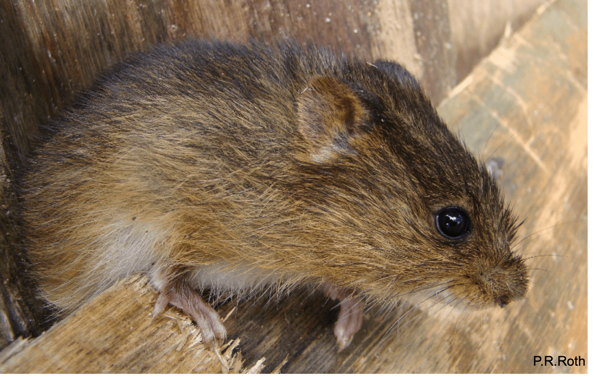
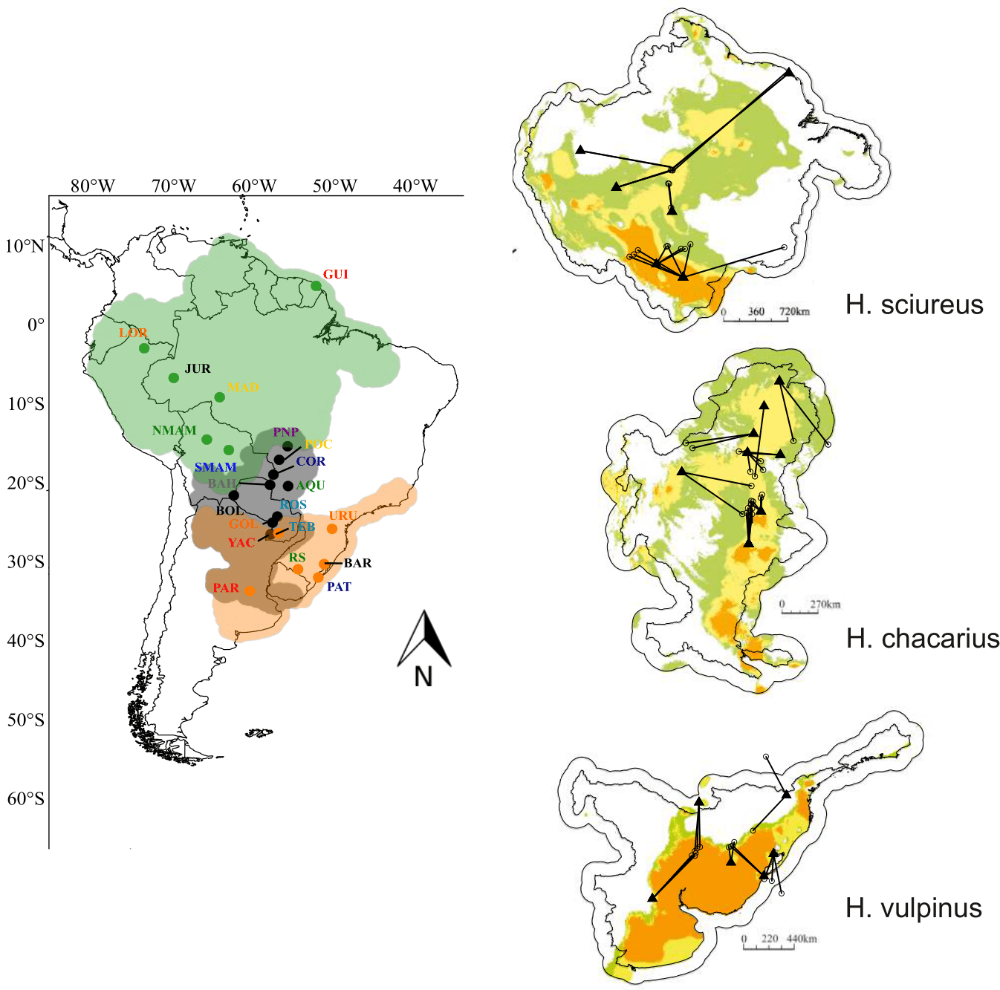

 

#Research

 

 

My work is related to understanding how abiotic and biotic factors interact and shape the patterns of genetic, morphological and ecological variation in small mammals
 

 
  

POSTDOCTORAL RESEARCH
 

The effect of climate change on the pattern of distribution, demography and genetic structure in neotropical semi-aquatic rodents.
 

Similar ecological restrictions imposed by wetlands in South American biomes structure the genetic and demographic variation between taxa in a similar way. However, due to current and historical differences in these areas, species may reflect specific variation patterns for each biome they inhabit. Alternatively, taxa with shared natural histories may exhibit concordant patterns of variation, despite different biomes. To assess which of these hypotheses best explains the genetic structure and demographic history in three species of the genus _Holochilus_, we used New Generation Sequencing (ddRadSeq), along with analytical techniques that provide spatially explicit information about how genomic variation is structured across the landscape. Results are coming soon!!!
  

 

PhD. RESEARCH

Comparative Phylogeography 

**Similar but different: Revealing the relative roles of species‐traits versus biome properties structuring genetic variation in South American marsh rats (Prado et al., 2019)**
  

 

My PhD dissertation had already demonstrated how the genetic variation in Holochilus species was structured throughout geography, revealing that there is a significant association between genetic variation and geography for all species. Similarity in the strength of the association suggests connectivity patterns dictated by shared species‐traits predominate at the biome scale. However, substantial amounts of genetic variation are not explained by geography. Focusing on this portion of the variance, we demonstrate a significant quantitative association between genetic variation and the environmental space of a biome, and a qualitative association with varying regional stability. Specifically, historically stable areas are correlated with local levels of geographic structuring, suggesting that local biome‐specific histories affect population isolation/connectivity.
 

 

Species Delimitation  

**New species boundaries and diversification history of marsh rat taxa clarifies historical connections among ecologically and geographically distinct wetlands of South America (Prado et al., in press)**
  

 

Taxa with broad geographic ranges that occur in different biomes and exhibit plastic morphological traits and/or adaptations to particular habitats make inferences about species boundaries especially challenging. However, technological and conceptual advances in the generation and analysis of genomic data have advanced the description of biodiversity. In this study (Prado et al., 2020) we address the outstanding questions about the delimitation of species in the genus _Holochilus_, a rodent with morphological specializations to wetland habitats, distributed through almost all the South America continent using genome‐wide SNP and morphometric data. Specifically, we apply a Bayesian model‐based species delimitation that revealed significant re-arrangements of species boundaries based on consideration of both morphometric and genomic data alone, or in combination. With these shifts in species boundaries, our results provide an insightful framework for considering putative dispersal corridors and debate surrounding their role in connecting disjunct South American biomes. Because of the ecological constraints of the marsh rats, and with the proposed taxonomic re-arrangements, the significance of our findings extends beyond systematics and suggests how diversification might be associated with past ecological/environmental linkages between disparate biomes during the Pleistocene. All the scripts and database of this manuscript is available on my [github] (https://github.com/joycepra).
  

 

 

Biogeography 

**Open vegetation dynamics and its role in structuring the diversity of sigmodontine rodents (Prado et al., in prep)**
 

 

Identifying mechanisms that promote lineage diversification is essential to understand biogeographic patterns. In this study we investigate the biogeographic processes related to the extant genera of the Oryzomyini clade D. This clade includes the most comprehensive generic diversity of the tribe, with lineages occupying distinct phytophysiognomies. The current distributional pattern and the presence of tetralophodonts genera in this clade suggest that there is a close relationship between these genera and the evolution of South Amercia open areas. Using a genomic dataset we construct a time calibrated tree, and estimate the range evolution through statistical model testing among different biogeographic models. The origin of clade D occurred approximately 3.5 Ma, and most of diversification events occurred during Pliocene. Geographic range estimates suggest that the ancestors of this clade were open area inhabitants of the Cis-Andean part, and the retraction and expantion of the open enviroments, together with the formation of Isthmus of Panama, favored the dispersion and diversification on this clade.This study is still in prep!!! 
 
